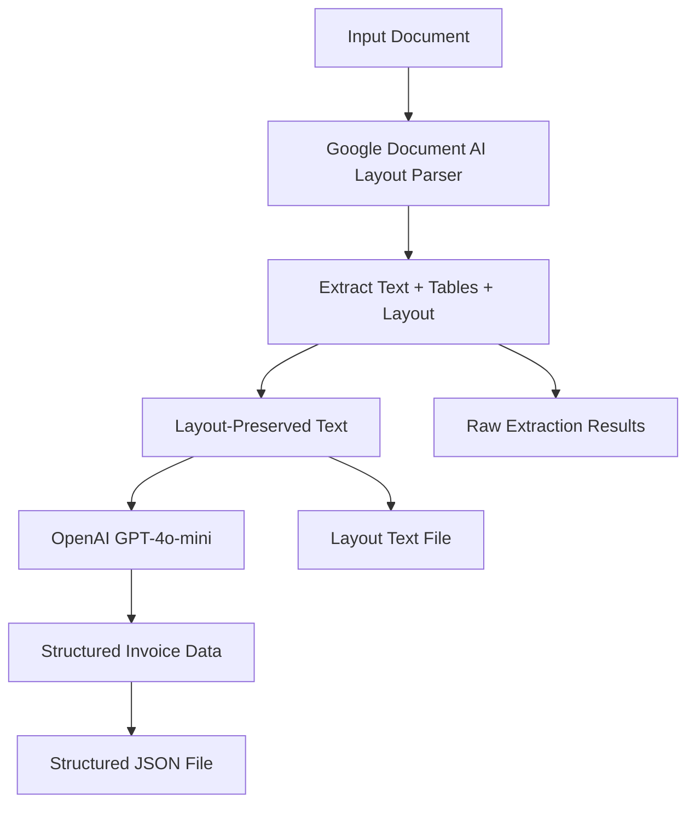

# Document AI + LLM Invoice Processing

This project combines Google Document AI with OpenAI's GPT-4o-mini to extract structured data from invoices. It first uses Google Document AI's Layout Parser to extract text while preserving document structure, then uses OpenAI to identify and extract the most important invoice information.

## Features

- 📄 **Document Processing**: Extract text from PDF, PNG, JPG, and other image formats
- 🏗️ **Layout Preservation**: Maintains document structure using Google Document AI's Layout Parser
- 📊 **Table Support**: Handles both text blocks and table blocks for comprehensive data extraction
- 🤖 **AI-Powered Analysis**: Uses OpenAI GPT-4o-mini to extract structured invoice data
- 📁 **Batch Processing**: Process single files or entire directories
- 💾 **Multiple Output Formats**: Raw text, structured JSON, and layout-preserved text

## Prerequisites

- Python 3.12+
- Google Cloud Account with Document AI API enabled
- OpenAI API account (optional, but recommended for structured data extraction)

## Setup

### 1. Clone the Repository

```bash
git clone https://github.com/yourusername/document_ai_llm.git
cd document_ai_llm
```

### 2. Create Virtual Environment

```bash
python -m venv .venv
source .venv/bin/activate  # On Windows: .venv\Scripts\activate
```

### 3. Install Dependencies

```bash
pip install -r requirements.txt
```

### 4. Configure Environment Variables

Copy the example environment file and configure it:

```bash
cp .env.example .env
```

Edit `.env` with your actual values:

```env
# Google Cloud Configuration
GOOGLE_CLOUD_PROJECT=your-google-cloud-project-id
GOOGLE_APPLICATION_CREDENTIALS=/path/to/your/service-account-key.json

# Document AI Configuration
DOCUMENT_AI_PROCESSOR_ID=your-processor-id-here
DOCUMENT_AI_LOCATION=eu  # or us

# OpenAI Configuration
OPENAI_API_KEY=your-openai-api-key-here
```

### 5. Google Cloud Setup

#### Create a Service Account

1. Go to [Google Cloud Console](https://console.cloud.google.com/)
2. Navigate to "IAM & Admin" > "Service Accounts"
3. Create a new service account with the following roles:
   - Document AI Editor
   - Document AI User
4. Download the JSON key file
5. Set `GOOGLE_APPLICATION_CREDENTIALS` to the path of this file

#### Create a Document AI Processor

1. Go to [Document AI Console](https://console.cloud.google.com/ai/document-ai/processors)
2. Create a new processor:
   - Type: **Layout Parser**
   - Region: Choose EU or US based on your preference
3. Copy the Processor ID and set it in your `.env` file

### 6. OpenAI Setup

1. Get your API key from [OpenAI Platform](https://platform.openai.com/api-keys)
2. Set it in your `.env` file as `OPENAI_API_KEY`

## Usage

### Command Line Interface

#### Basic Usage

Process a single invoice:
```bash
python main.py path/to/invoice.pdf --project-id your-project-id
```

Process with specific processor ID:
```bash
python main.py path/to/invoice.pdf --project-id your-project-id --processor-id your-processor-id
```

Process without OpenAI (OCR only):
```bash
python main.py path/to/invoice.pdf --project-id your-project-id --no-openai
```

Process entire directory:
```bash
python main.py path/to/invoices/ --project-id your-project-id
```

#### Command Line Options

| Option | Description | Required | Default |
|--------|-------------|----------|---------|
| `input_path` | Path to invoice file or directory | Yes | - |
| `--project-id` | Google Cloud Project ID | Yes | - |
| `--processor-id` | Document AI Processor ID | No | Auto-creates if not provided |
| `--location` | Processor location | No | `eu` |
| `--output-dir` | Output directory for results | No | `invoices/document_ai_llm/results` |
| `--openai-api-key` | OpenAI API key | No | Uses `OPENAI_API_KEY` env var |
| `--no-openai` | Skip OpenAI processing | No | `false` |

### Python API

```python
from main import DocumentAILayoutParser, InvoiceAnalyzer

# Initialize the parser
parser = DocumentAILayoutParser(
    project_id="your-project-id",
    processor_id="your-processor-id",
    location="eu"
)

# Process an invoice
results = parser.process_invoice(
    file_path="path/to/invoice.pdf",
    use_openai=True,
    openai_api_key="your-api-key"
)

# Access structured data
structured_data = results.get("structured_data")
if structured_data:
    print(f"Invoice Number: {structured_data['invoice_number']}")
    print(f"Total Amount: {structured_data['total_amount']}")
    print(f"Seller: {structured_data['seller_name']}")
```

## Output Files

The script generates three types of output files:

1. **`invoice_extracted.json`** - Complete extraction results with raw text, metadata, and structured data
2. **`invoice_layout.txt`** - Layout-preserved text for human reading
3. **`invoice_structured.json`** - Clean structured data extracted by OpenAI (when available)

### Structured Data Schema

```json
{
  "invoice_number": "FV 152011",
  "issue_date": "2011-04-14",
  "due_date": "2011-04-21",
  "seller_name": "M-złomen",
  "seller_address": "Stoińskiego 19, 45-757 Opole",
  "seller_tax_id": "542-896-25-23",
  "buyer_name": "PUHP „AMBIT" Sp.z o. o.",
  "buyer_address": "Jaracza 1, 15-186 Białystok",
  "buyer_tax_id": "542-020-68-40",
  "total_amount": "6 120,00",
  "net_amount": "5 200,00",
  "tax_amount": "920,00",
  "currency": "PLN",
  "line_items": [
    {
      "description": "Złom stalowy",
      "quantity": "1,500",
      "unit_price": "800,00",
      "total_price": "1 200,00",
      "tax_rate": "*"
    }
  ],
  "payment_terms": "przelew 7 dni",
  "payment_method": "bank transfer"
}
```

## Architecture



## File Structure

```
document_ai_llm/
├── main.py                 # Main processing script
├── requirements.txt        # Python dependencies
├── .env.example           # Environment variables template
├── .gitignore             # Git ignore rules
├── README.md              # This file
├── invoices/              # Sample data directory
│   └── document_ai_llm/
│       └── results/       # Output files
└── .venv/                 # Virtual environment (created by setup)
```

## Supported File Formats

- **PDF** documents
- **Image files**: PNG, JPG, JPEG, TIFF, TIF, BMP, GIF

## Error Handling

The application handles various error scenarios:

- Invalid file paths or unsupported formats
- Google Cloud authentication failures
- Document AI processing errors
- OpenAI API failures (gracefully degrades to OCR-only mode)
- Missing environment variables

## Development

### Running Tests

```bash
# Install development dependencies
pip install pytest pytest-cov

# Run tests
pytest tests/

# Run with coverage
pytest --cov=main tests/
```

### Code Formatting

```bash
# Install formatting tools
pip install black isort

# Format code
black main.py
isort main.py
```

## Troubleshooting

### Common Issues

1. **Authentication Error**
   - Verify `GOOGLE_APPLICATION_CREDENTIALS` points to valid service account key
   - Ensure service account has Document AI permissions

2. **Processor Not Found**
   - Check processor ID is correct
   - Verify processor is in the same location (EU/US) as specified

3. **OpenAI API Errors**
   - Verify API key is valid and has sufficient credits
   - Check rate limits and quotas

4. **Permission Denied**
   - Ensure service account has necessary IAM roles
   - Check Google Cloud project billing is enabled

### Debug Mode

Enable debug logging by setting:
```bash
export LOG_LEVEL=DEBUG
```

## Contributing

1. Fork the repository
2. Create a feature branch: `git checkout -b feature-name`
3. Make changes and add tests
4. Run tests: `pytest`
5. Format code: `black main.py && isort main.py`
6. Commit changes: `git commit -am 'Add feature'`
7. Push to branch: `git push origin feature-name`
8. Submit a Pull Request

## License

This project is licensed under the MIT License - see the [LICENSE](LICENSE) file for details.

## Acknowledgments

- [Google Cloud Document AI](https://cloud.google.com/document-ai) for document processing
- [OpenAI](https://openai.com/) for structured data extraction
- Layout Parser for maintaining document structure

## Support

For support, please:
1. Check the [troubleshooting section](#troubleshooting)
2. Search existing [GitHub issues](https://github.com/yourusername/document_ai_llm/issues)
3. Create a new issue with detailed information about your problem

---

**Note**: This project processes potentially sensitive financial documents. Always ensure you comply with data protection regulations and handle documents securely.